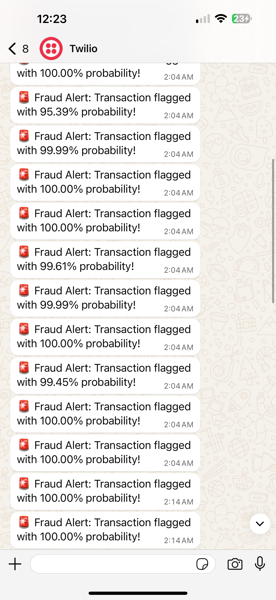
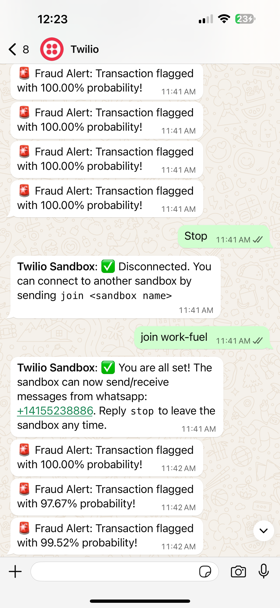
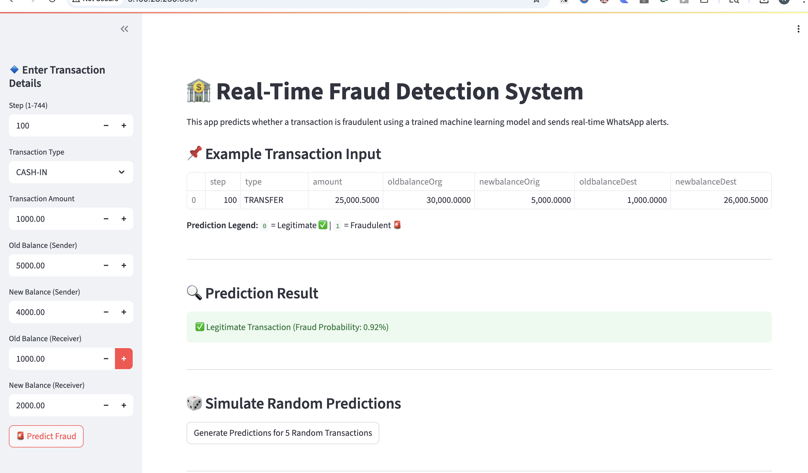
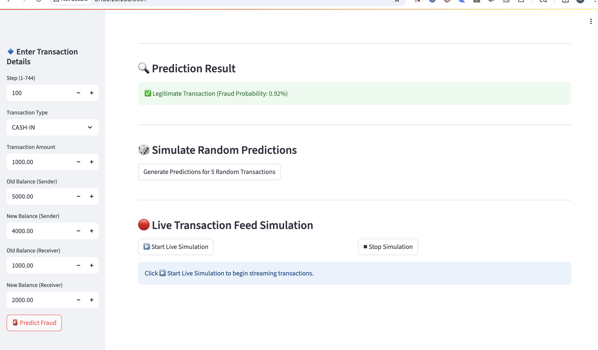
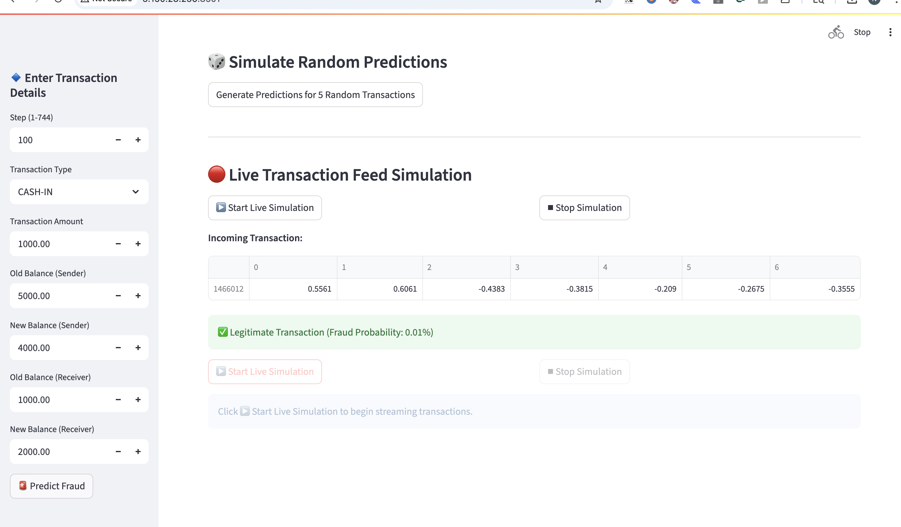
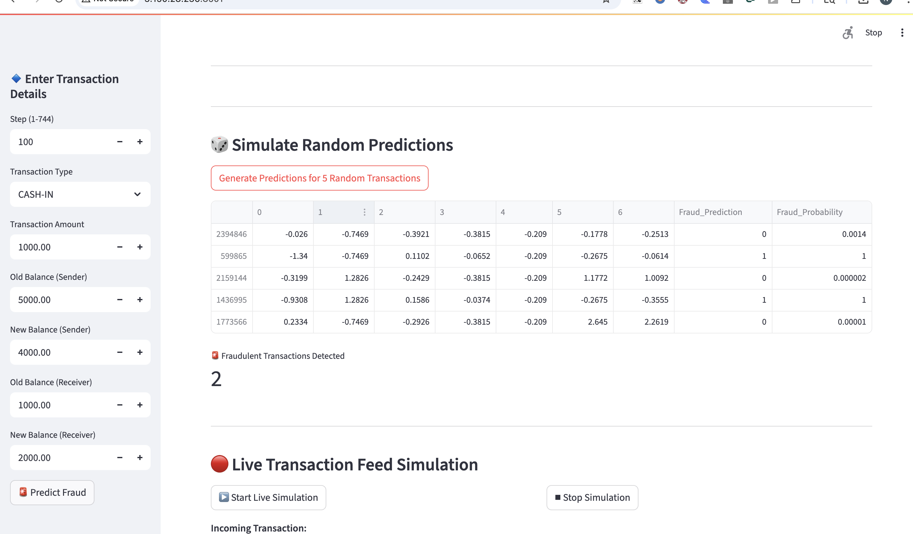

# 💳 Fraud Detection System with Real-Time WhatsApp Alerts

A full-stack machine learning dashboard to detect fraudulent financial transactions, built with **Streamlit**, deployed on **AWS EC2**, and integrated with **Twilio WhatsApp API** for real-time alerts.

## 🌐 Live Demo

👉 [http://3.150.28.236:8501](http://3.150.28.236:8501)

---

## 🚀 Features

- 📈 **Dashboard UI**: Clean and interactive Streamlit app
- 🧠 **ML Model**: Trained binary classifier to detect fraud
- 🔔 **WhatsApp Alerts**: Real-time fraud alerts via Twilio
- ☁️ **Hosted on AWS EC2** with persistent Elastic IP
- ♻️ **Auto-starts after reboot** using `crontab`
- 🔒 Virtual environment isolation for reproducibility

---

## 🧠 Tech Stack

- **Frontend**: Streamlit
- **Backend**: Python 3.12
- **ML Model**: scikit-learn
- **Alerts**: Twilio WhatsApp API
- **Hosting**: AWS EC2 (Ubuntu 24.04), Elastic IP
- **Deployment**: Virtualenv + crontab for auto-start

---

## 📁 Directory Structure

```
Fraud_Detection_System/
├── data/                        # Raw and preprocessed data
├── app_dashboard.py            # Main Streamlit app
├── fraud_model.pkl             # Trained ML model
├── requirements.txt            # Python dependencies
├── .env                        # Twilio credentials (not shared)
└── streamlit_log.txt           # Runtime logs
```

---

## ⚙️ Setup Instructions (Local)

```bash
git clone https://github.com/your-username/Fraud_Detection_System.git
cd Fraud_Detection_System
python3 -m venv venv
source venv/bin/activate
pip install -r requirements.txt
streamlit run app_dashboard.py
```

---

## 🔐 WhatsApp Integration (Optional)

- Create a `.env` file:
```env
TWILIO_SID=your_twilio_sid
TWILIO_AUTH_TOKEN=your_twilio_auth_token
TWILIO_WHATSAPP_NUMBER=whatsapp:+14155238886
TARGET_WHATSAPP_NUMBER=whatsapp:+91xxxxxxxxxx
```

---

## 📸 Screenshot
### ✅ Screenshot – WhatsApp Alert Confirmation

### 📈 Screenshot – Prediction Output

### 🧾 Screenshot – Dashboard Page

### 🧾 Screenshot – Dashboard Page

### 🧾 Screenshot – Dashboard Page

### 🧾 Screenshot – Dashboard Page



---

## 👤 Author

**Naga Ramya Gurrala**  
🔗 [LinkedIn](https://www.linkedin.com/in/nagaramyagurrala/) | 💻 [Portfolio](https://github.com/NagaRamya1531-tech)

---

## 📃 License

MIT License – feel free to use and modify
